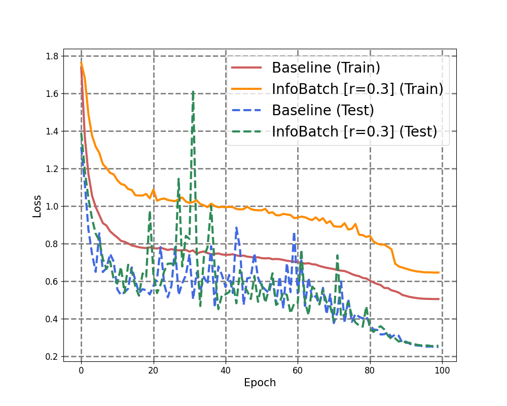
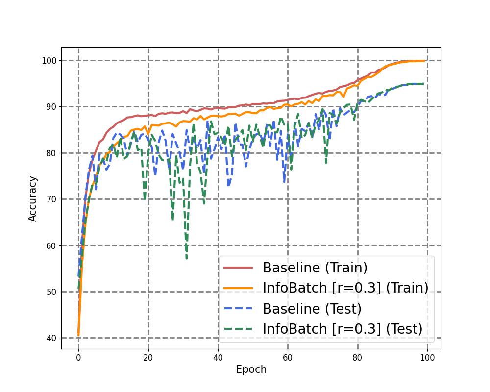
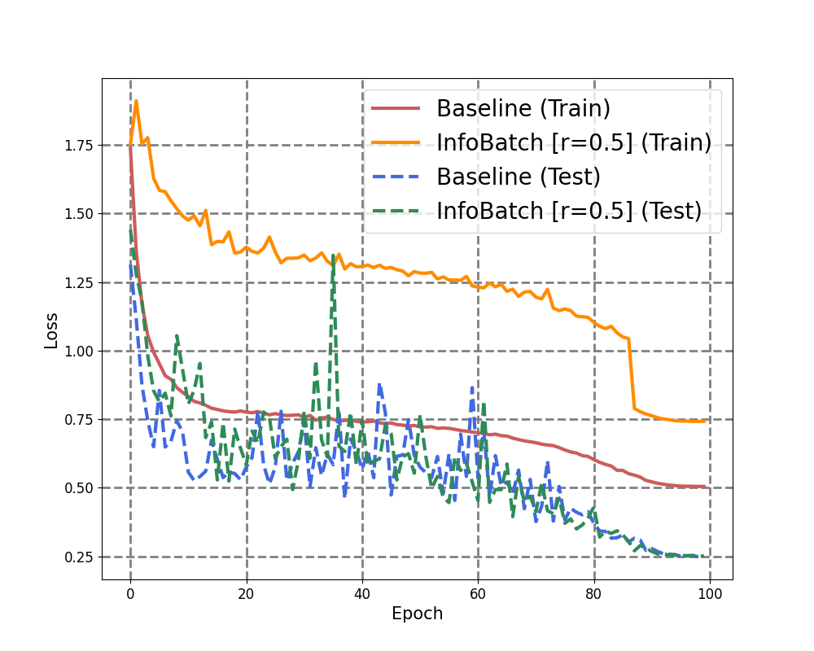
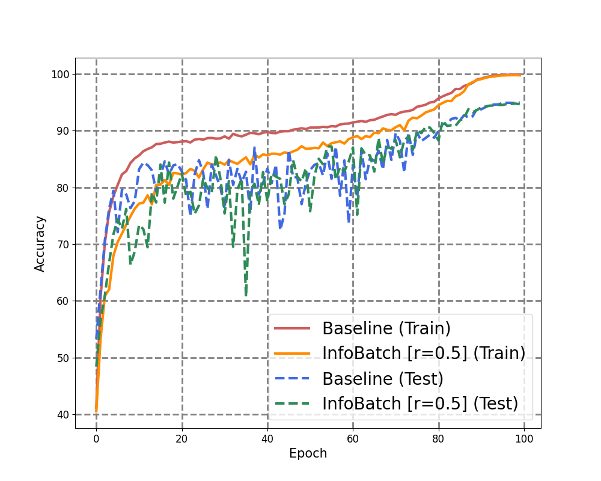
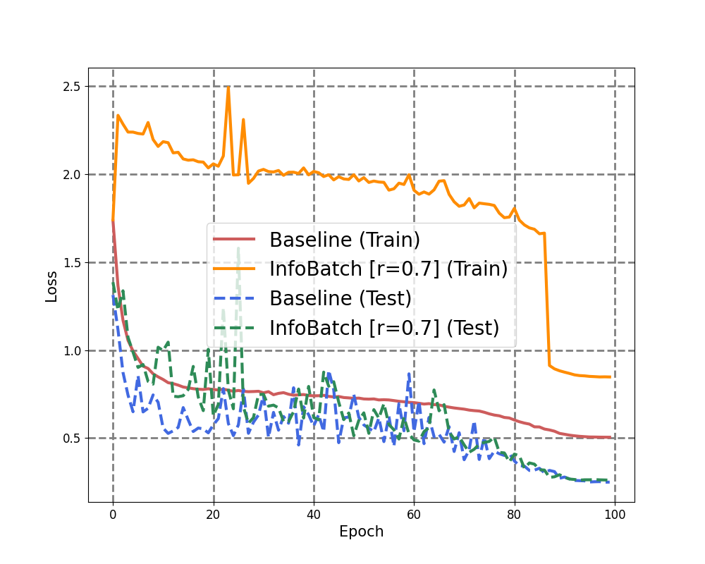
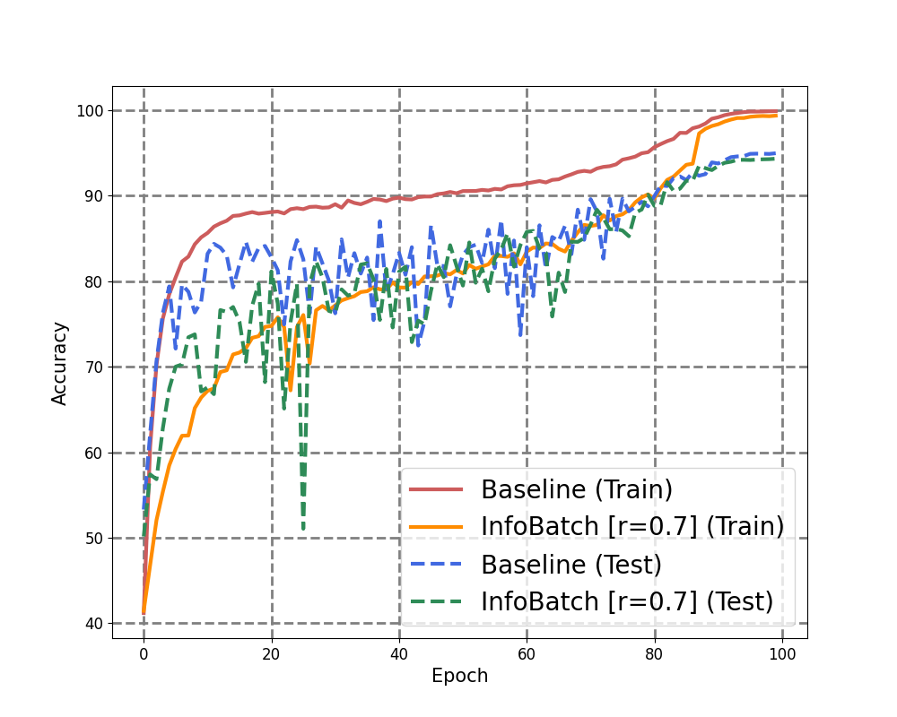

# [LINE Plus] VOOM AI lab - AI Engineer 과제 전형
LINE Plus VOOM AI lab - AI Engineer 포지션의 과제 전형에 참여할 기회를 주신 것에 감사드립니다.

# Introduction
LINE Plus VOOM AI lab - AI Engineer 포지션의 과제 전형에 참여할 기회를 주신 것에 감사드립니다. <br><br>
본 Repo에서는 과제 전형 (TYPE B) - “InfoBatch: Lossless Training Speed Up by Unbiased Dynamic Data Pruning” 논문의 실험을 재현합니다. <br>
해당 논문에서 제안하는 InfoBatch 기법을 사용했을시 Baseline 모델 대비 학습 속도는 개선 되면서 성능은 유지됨을 확인하는 것이 본 Repo의 목표입니다. <br>
컨텐츠는 다음과 같습니다:

## Contents
[1. Getting Started](#1-getting-started) <br>
[2. Data Preparation](#2-data-preparation) <br>
[3. Training](#3-training) <br>
[4. Testing](#4-testing) <br>
[5. Experiments](#5-experiments) <br>
[6. Citation](#6-citation) 

## 1. Getting Started
### 1) Experimental Settings
##### Hardware specifications <br>
- ```GPU```: NVIDIA T4 Tensor Core GPU x 4
##### Requirements <br>
본 과제는 torch 2.0.1+cu117 & torchvision 0.16.2+cu118을 이용하여 수행되었습니다. <br>
터미널에서 아래 명령어를 입력하여 필요한 라이브러리를 설치할 수 있습니다.
``` 
$ pip install -r requirements.txt
```

## 2. Data Preparation
본 실험에서는 CIFAR-10 데이터셋이 사용되었습니다. <br>
아래의 Training을 통해 학습 코드를 실행하면 자동으로 다운로드 됩니다.

## 3. Training
실험을 위해 터미널에서 아래 명령어를 입력하면 모델 학습을 시작할 수 있습니다.
```
# Baseline model (batch_size=256)
CUDA_VISIBLE_DEVICES=0,1  python train.py --experiment_name cifar10_resnet18_baseline_b256 --model ResNet18 --train_batch_size 256 --num_epoch 100 --ratio 0.0 --delta 0.0

# InfoBatch (r=0.3, batch_size=256)
$ CUDA_VISIBLE_DEVICES=0,1 python train.py --experiment_name cifar10_resnet18_infobatch_r_0_3_b256 --use_info_batch --model ResNet18 --train_batch_size 256 --num_epoch 100 --ratio 0.3 --delta 0.875

# InfoBatch (r=0.5, batch_size=256)
$ CUDA_VISIBLE_DEVICES=0,1 python train.py --experiment_name cifar10_resnet18_infobatch_r_0_5_b256 --use_info_batch --model ResNet18 --train_batch_size 256 --num_epoch 100 --ratio 0.5 --delta 0.875

# InfoBatch (r=0.7, batch_size=256)
$ CUDA_VISIBLE_DEVICES=0,1 python train.py --experiment_name cifar10_resnet18_infobatch_r_0_7_b256 --use_info_batch --model ResNet18 --train_batch_size 256 --num_epoch 100 --ratio 0.7 --delta 0.875
```

## 4. Testing
터미널에서 아래 명령어를 입력하면 학습이 완료된 모델의 성능을 테스트 할 수 있습니다. <br>
학습된 모델(.pth)은 `./saved_models` 폴더에서 확인할 수 있습니다.
```
# Baseline model (batch_size=256)
CUDA_VISIBLE_DEVICES=0,1 python test.py --experiment_name cifar10_resnet18_baseline_b256 --model ResNet18

# InfoBatch (r=0.3, batch_size=256)
$ CUDA_VISIBLE_DEVICES=0,1 python test.py --experiment_name cifar10_resnet18_infobatch_r_0_3_b256 --model ResNet18

# InfoBatch (r=0.5, batch_size=256)
$ CUDA_VISIBLE_DEVICES=0,1 python test.py --experiment_name cifar10_resnet18_infobatch_r_0_5_b256 --model ResNet18

# InfoBatch (r=0.7, batch_size=256)
$ CUDA_VISIBLE_DEVICES=0,1 python test.py --experiment_name cifar10_resnet18_infobatch_r_0_7_b256 --model ResNet18
```

## 5. Experiments
#### Implementation details
논문의 실험 설정을 인용하여 CIFAR-10 데이터셋을 이용하여 Image Classification 태스크에서 InfoBatch의 효과를 검증하였습니다. <br>
Backbone Network로는 ResNet18 모델을 사용하였고, CrossEntrophy Loss (Label Smoothing 0.1), SGD Optimizer (momentum=0.9, weight decay=5e-4),
OneCycle LR scheduler (max_LR = 2.0)을 사용하는 등 논문과 동일하게 설정하였습니다. <br>
조금 더 빠른 실험을 위하여 논문과는 달리 batch size를 128이 아닌 256으로 설정하였습니다. <br>
또한, Pruning Ratio (r)는 0.3, 0.5, 0.7 세가지로 변경하며 설정을 하였고 Annealing Ratio (δ)는 동일하게 0.875로 설정하여 실험을 수행하였습니다. 

#### Experimental results
|Method|Best Accuracy (%)|Total Training Time (Min)|
|:---:|:---:|:---:|
|Full Dataset|94.98|166.75|
|InfoBatch (r=0.3)|94.94(⬇0.04)|130.26(⬇36.49)|
|InfoBatch (r=0.5)|94.79(⬇0.19)|111.83(⬇54.92)|
|InfoBatch (r=0.7)|94.34(⬇0.64)|86.49(⬇80.26)|

실험 결과, Pruining Ratio (r)을 0.3으로 설정했을떄, 전체 데이터셋을 모두 이용한 Baseline 대비 성능은 94.98%에서 94.94%로 약 0.04% 감소하여 거의 동등한 성능을 보였고,
총 학습 시간은 166.75분에서 111.83분으로 약 33% 감소하여 동등한 성능을 유지하며 학습 속도를 개선할 수 있음을 확인하였습니다. 

#### Visualize
터미널에서 아래 명령어를 입력하면 Baseline 모델과 InfoBatch 모델의 Accuracy와 Loss를 그래프로 비교할 수 있습니다.<br>
```
# Baseline vs. Infobatch (r=0.3)
python visualize.py --infobatch_experiment_name cifar10_resnet18_infobatch_r_0_3_b256

# Baseline vs. Infobatch (r=0.5)
python visualize.py --infobatch_experiment_name cifar10_resnet18_infobatch_r_0_5_b256

# Baseline vs. Infobatch (r=0.7)
python visualize.py --infobatch_experiment_name cifar10_resnet18_infobatch_r_0_7_b256
```

<p align="center">
  
  
</p>
<p align="center">
  <b>[Baseline vs. Infobatch (r=0.3): accuracy와 train/test loss 비교]</b>
</p>

<p align="center">
  
  
</p>
<p align="center">
  <b>[Baseline vs. Infobatch (r=0.5): accuracy와 train/test loss 비교]</b>
</p>

<p align="center">
  
  
</p>
<p align="center">
  <b>[Baseline vs. Infobatch (r=0.7): accuracy와 train/test loss 비교]</b>
</p>


## 6. Citation
```bibtex
@inproceedings{
  title={InfoBatch: Lossless Training Speed Up by Unbiased Dynamic Data Pruning},
  author={Qin, Ziheng and Wang, Kai and Zheng, Zangwei and Gu, Jianyang and Peng, Xiangyu and Zhaopan Xu and Zhou, Daquan and Lei Shang and Baigui Sun and Xuansong Xie and You, Yang},
  booktitle={The Twelfth International Conference on Learning Representations},
  year={2024},
  url={https://openreview.net/forum?id=C61sk5LsK6}
}
```
